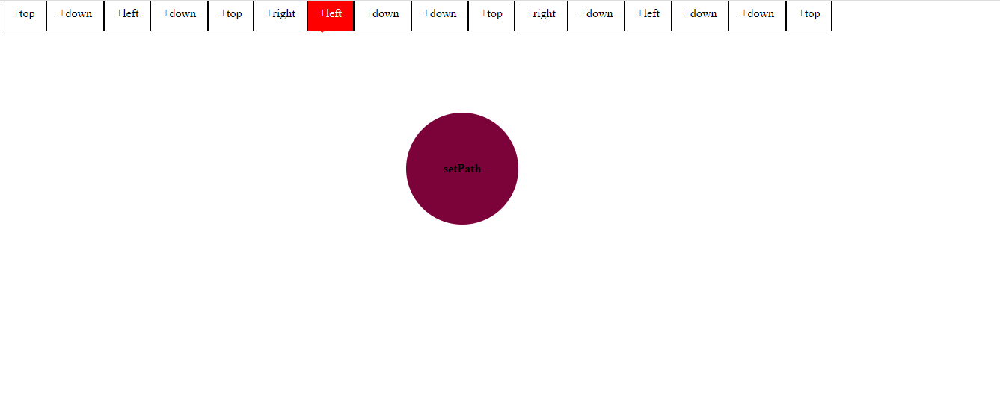

# functionator
 
  <b> 1.All javascript NO HTML.</b>
 
  <b> 2.Press keySetup movements(arrow keys->left,right,top,bottom,R->Random generator).</b>
 
  <b> 3.Remove actions by click.</b>
 
  <b> 4.Run action sequence when ready(keys->spacebar,enter).</b>
 
  <b> 5.Finally the box will move :)))</b>

   
  
